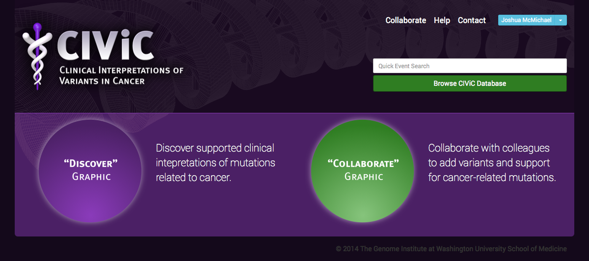
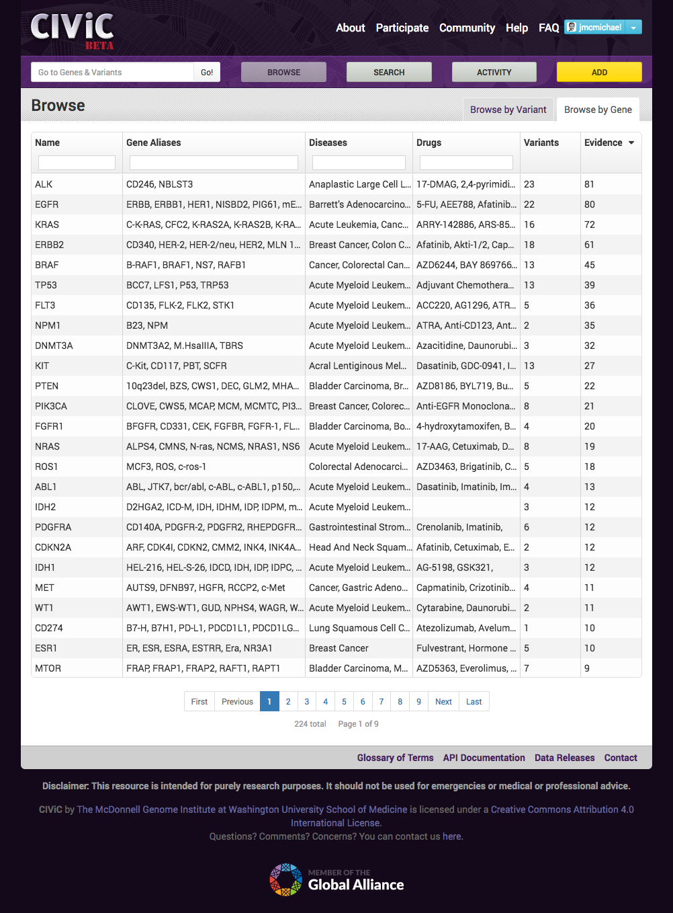
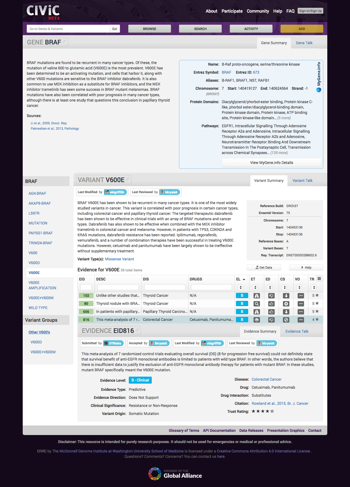
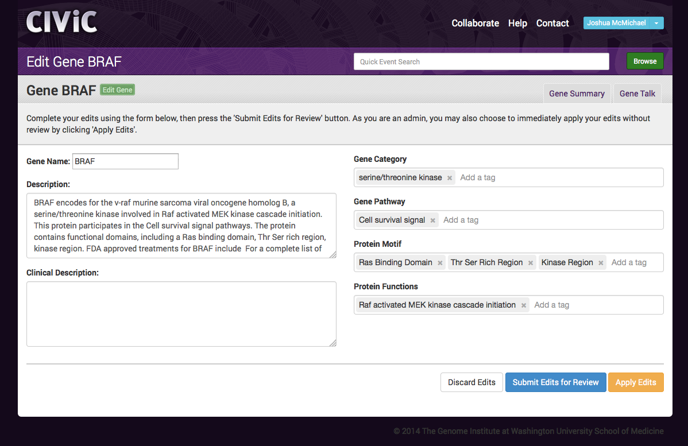
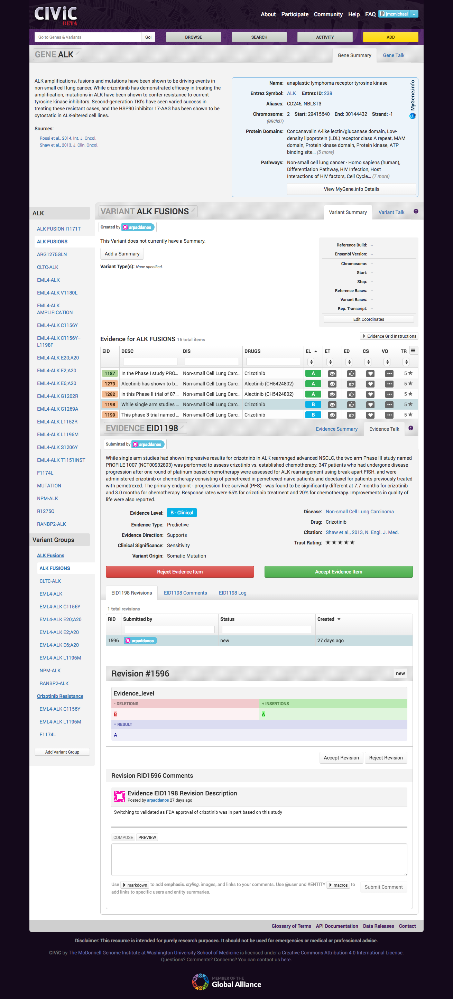
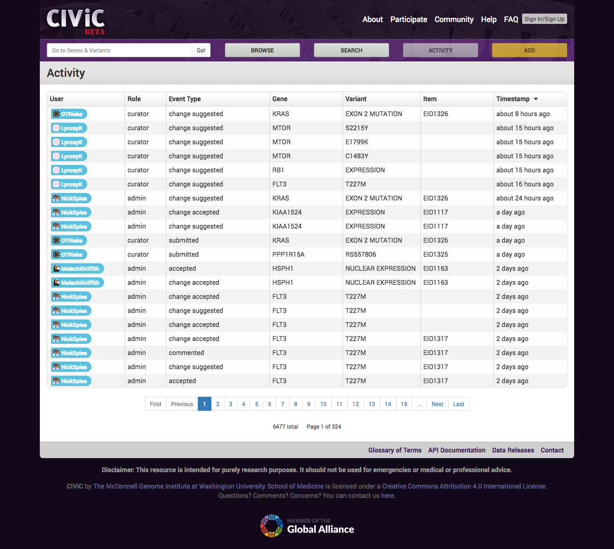
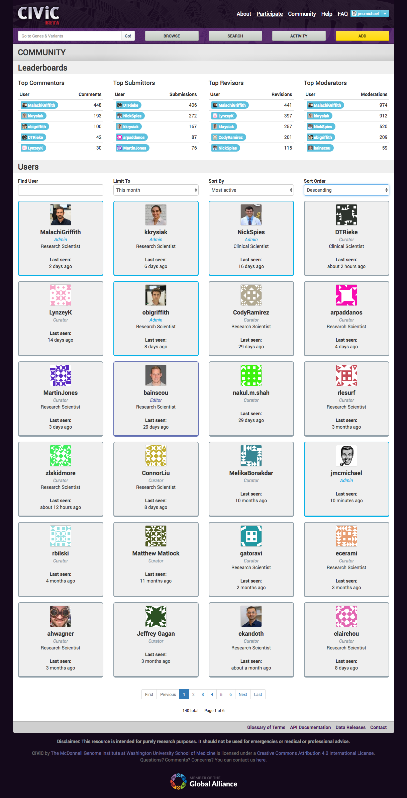

civic-client
============

[](https://zenodo.org/badge/latestdoi/22993377)


Developing for CIViC involves setting up a development environment. To get started quickly, we recommend launching an AWS EC2 instance from our pre-configured and maintained AMI ([getting started wiki page](https://github.com/genome/civic-server/wiki/Getting-Started-with-CIViC-Development-on-AWS)).

Alternatively, you may set up your own local development environment using the following setup instructions.

## To Install

civic-client uses yarn for development, build, and resource server tasks, so ensure that you have yarn (and nodeJS) installed and running. Yarn installation instructions are here:

https://yarnpkg.com/lang/en/docs/install/

Once you've installed Yarn, clone the civic-client repository and cd to it, then:

```bash
yarn install
```

Yarn will determine the packages it needs to install, download, and install them for you - it may take awhile. Then we need to install bower, which manages client-side packages:

```bash
yarn global add bower
```

Once bower is installed, use it to install civic-client's runtime libraries:

```bash
bower install
```

If bower becomes confused about which Angular version to use, pick the first one that offers version 1.3.15.

## Development

CIViC client uses the gulp workflow system for serving, watching, building, and testing the client codebase. Let's install that:

```bash
yarn global add gulp
```

Once we have gulp installed, start up the CIViC server (execute `rails s` from the server's root directory), then start up the client server with:

```bash
gulp serve
```

Then load `http://127.0.0.1:3001` in your browser. *NOTE:* use `127.0.0.1`, not `localhost`. A couple of the OAuth providers we use for authentication will only work if the app is loaded from `127.0.0.1`. 

The `serve` tasks starts a static file server, and a proxy that routes calls to /api to the civic-server listening on port 3000. It serves the AngularJS application, and a starts a watch task which watches all files for changes and lints, builds and injects them into the index.html accordingly.

## Production ready build - a.k.a. dist

To make the app ready for deploy to production run:

```bash
gulp build
```

The build task creates a `./dist` folder with all scripts and stylesheets concatenated, minified, and versioned, also third party libraries installed with bower will be concatenated and minified into `vendors.min.js` and `vendors.min.css` respectively.

To test the build version of the app, execute:

```bash
gulp serve:dist
```

This task executes a build, then serves the /dist directory from the same port as the `gulp serve` task, http://127.0.0.1:3001/

## Pulling Updates
As the civic-client is under heavy development, we'll be pushing releases to the master branch at a fairly rapid rate. Often, we'll update various packages and modules that are part of the workflow and/or production codebase. So after you do a `git pull` to update your local repository, be sure to:

```bash
yarn install
bower install
```

This will install any new packages or modules that the new updates require.

## Related resources
* [Personalized Cancer Therapy Knowledge Base for Precision Oncology (MD Anderson Cancer Center)](https://pct.mdanderson.org/)
* [My Cancer Genome - Genetically Informed Cancer Medicine (Vanderbilt-Ingram Cancer Center)](http://www.mycancergenome.org/)
* [Targeted Cancer Care (Massachusetts General Hospital)](https://targetedcancercare.massgeneral.org/My-Trial-Guide/Mutations.aspx)

## Screenshots
**Homepage:**


**Browse Genes in the CIViC database:**


**View an Evidence Item:**


**Edit a Gene:**


**View and comment on revisions to Genes, Variants, Evidence Items:**


**Catch up with recent CIViC activity:**


**Community leaderboards and user directory:**


### Git repositories related to the CIViC project
The CIViC source code and application are organized in a client-server model. The backend code is available in the [civic-server repository](https://github.com/genome/civic-server) and frontend code is available in the [civic-client repository](https://github.com/genome/civic-client). Issues relating to curation are tracked in the [civic-curation repository](https://github.com/genome/civic-curation). An example of a Python client is available in the [civic-api-client repository](https://github.com/griffithlab/civic-api-client). Issues relating to public CIViC meetings are tracked in the [civic-meeting repository](https://github.com/genome/civic-meeting).

